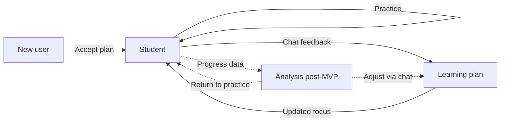

# Customer Journey Map

Status: **draft**

This document describes the primary user journeys in Lingua Coach — from first visit through chat-guided learning. Each journey is goal-oriented: what the user wants, what they do, and what outcome they reach.

**Agent skills** ([skills/README.md](../../skills/README.md)) implement journey steps; artifacts persist per [database.md](../tech_requirements/database.md).

**MVP scope:** Journeys 1 (New user) and 2 (Student) are in scope. Journey 3 (Analysis) and skill `feedback_giver` are **post-MVP** — captured here for product direction, not first-ship UX.

**MVP modality:** All journeys use **text chat only** — typed messages in, streamed tutor text out. Onboarding, plan refinement, and lesson practice share the same text chat surface. Speaking and listening skills are practiced **in text** (e.g. typed monologues, role-play turns, comprehension questions; optional links to external reading/listening). Voice input, text-to-speech, and video are **post-MVP**.

---

## Journey overview

| Journey | MVP | Entry point | Primary outcome |
|---------|-----|-------------|-----------------|
| [New user](#1-new-user-journey) | **Yes** | Clerk sign-in / sign-up | Accepted learning plan; user enters the main learning flow |
| [Student](#2-student-journey) | **Yes** | Main section (dashboard / chat) | Completed lesson (accomplished task) |
| [Analysis](#3-analysis-journey-post-mvp) | **No** | Profile section (future) | Clear view of progress, skills, and time to goal |

---

## 1. New user journey

**Goal:** Create an account and define a personalized learning plan before starting practice.

### Flow

```
Clerk sign-in → Onboarding chat → Learning plan → Accept plan → Main learning flow
```

### Steps

1. **Sign in (MVP entry)**
   - User lands on **Clerk sign-in / sign-up** (email / magic link). No marketing landing page in MVP.
   - New users authenticate and are synced into the product.

2. **Enter the system**
   - After authentication, the user is routed to **onboarding chat** — not the main learning area yet.

3. **Onboarding chat (interview)** — skill: `onboarding_interviewer`, then `course_composer`
   - The user interacts with a **chat-based interview** (chat-first product) that reveals:
     - **Goal** — why they are learning and the concrete outcome / horizon (e.g. “conversational at work in 6 months”)
     - **Level** — current English level (e.g. CEFR-ish)
     - **Topics / priorities** — focus areas and vocabulary priorities
     - **Time budget** — how much time they can spend and how demanding the program should feel
   - Based on the interview, the system generates and **presents a learning plan** (course plan: goal, level, topics, priorities, time budget, **schedule**).
   - **Schedule** = estimated **plan days** to reach the goal. One **plan day** equals one **accomplished lesson** (lesson ≡ plan day). This is **not** a calendar assignment — there is no “Monday’s lesson.” The agent derives total plan days from goal, level, topics, and time budget (e.g. “~90 plan days to conversational at work at your pace”).

4. **Plan refinement**
   - The user can **modify the plan in the same chat** (adjust goals, topics, pace, or other parameters).
   - The tutor updates the proposed plan until it matches the user’s expectations.

5. **Acceptance**
   - The user **accepts the plan** (explicit action in chat or UI).
   - On acceptance, onboarding is complete and the user enters the **main learning journey** (student journey).

### Success criteria

- User has an account and an accepted, persisted learning plan.
- User understands what they are working toward, the estimated plan length (plan days), and the pacing expectation (one accomplished lesson per 24 hours when actively working).

---

## 2. Student journey

**Goal:** Complete the current lesson through chat-guided practice and stay aligned with the learning plan over time.

### Flow

```
Main section → Start lesson → Chat-guided practice → Accomplished task (plan day)
        ↑                                              |
        └──────── Resume active lesson ────────────────┘
                    ↑                                    |
                    └──── Feedback / plan change ────────┘
```

### Steps

1. **Main section**
   - Returning users land in the main area (dashboard with plan overview).
   - If a lesson is **active** (started but not accomplished), the user **resumes** it.
   - If no active lesson, the user clicks **Start lesson** to generate the next one on demand.

2. **Sequential lessons via chat** — skill: `exercise_tutor` (+ `vocabulary_practice_formats` when used)
   - Lessons are numbered sequentially (**lesson 1, 2, 3, …**) — not tied to calendar dates.
   - Each accomplished lesson counts as **one plan day** toward the schedule set at onboarding.
   - Lessons are **not pre-generated**. Each new lesson is created when the user starts it, informed by the learning plan plus **previous lessons’ progress, results, and errors**.
   - The user practices through **text chat** with the AI tutor, which guides them through the lesson focus, corrects mistakes, and tracks completion. Structured exercise content from the lesson JSON is delivered **in chat**, not as a separate worksheet UI. “Speaking” and “listening” slots mean **typed production and text-based comprehension** in MVP — not microphone or in-app audio.

3. **Plan schedule and pacing**

   - **On pace:** the user **finishes a lesson within 24 hours of starting it** (`started_at` → `accomplished_at`). That satisfies the time budget for that plan day.
   - **Real time is flexible:** a lesson may stay **`active`** across many calendar days (stop / resume). The 24-hour window measures elapsed time from start to finish, not calendar days on a grid.
   - **Reschedule:** if the user finishes **after 24 hours** from lesson start, the learning plan **slips by one plan day** — projected completion moves later. The user is **not blocked** from continuing; the schedule projection updates.
   - Dashboard shows minimal pace hints in MVP: plan days done vs target, on pace / behind, projected completion (see [frontend.md](../tech_requirements/frontend.md)).

4. **Lesson lifecycle**

   | Action | Behavior |
   |--------|----------|
   | **Start lesson** | Allowed only when no other lesson is **`generating`** or **`active`**. Backend assigns the next `lesson_number`, runs generation job, sets `started_at` when the lesson becomes active, then opens chat. |
   | **Stop session** | User pauses mid-lesson. Lesson stays **`active`**; chat session ends. User can return and resume later. |
   | **Finish lesson** | User taps **Finish lesson** (always available while active). Tutor sets `suggest_finish` when all planned exercises are done; user may also finish early. Lesson → `accomplished`; `session_summary` records completed vs incomplete slots (incomplete = 0%); progress and mistakes finalized; pacing evaluated (24h rule); schedule may reschedule; chat transcript deleted. User may start the next lesson. |
   | **Resume** | User continues an **`active`** or in-progress **`generating`** lesson from the dashboard — no new generation. |

   - Only **one in-flight lesson** (`generating` or `active`) at a time. Starting a new lesson requires the current one to be **accomplished** (or abandoned only if product adds that later — not MVP).

5. **Feedback and plan changes**

   - At any point during practice (or onboarding), the user can **give feedback** (too hard, wrong topic, need more speaking, etc.) or **request a program change** **in chat**.
   - The tutor handles the request conversationally; the backend **updates the learning plan** from chat (`plan_updates`) — there are **no dedicated plan editors** in profile or settings. Schedule fields (e.g. target plan days) may change via chat and trigger a recomputed projection.
   - **MVP:** inline tutor feedback in lesson chat + pace hints on dashboard. **Post-MVP:** structured progress updates and weekly gates via `feedback_giver`.

### Success criteria

- User completes (or consciously stops) the current lesson.
- On **finish**, progress and mistakes from the session are recorded; pacing is evaluated against the 24-hour rule.
- Plan adjustments from chat feedback are applied to subsequent lessons.

---

## 3. Analysis journey (post-MVP)

> **Out of MVP scope.** Retained as the target experience for a later release, implemented by skill [`feedback_giver`](../../skills/feedback_giver.md). MVP shows **minimal pace hints** on the dashboard (plan days done, on pace / behind, projected completion) — not the full analysis UI.

**Goal:** Understand how learning is going, where strengths and gaps are, and how far the user is from their goal.

### Flow

```
Profile section → Statistics & progress → Insight per skill → (optional) adjust plan via chat
```

### Steps

1. **Profile section**
   - The user opens a **profile / analysis** area to review learning history and trajectory (not the primary practice surface).

2. **Statistics and progress**
   - **Accomplished lessons** — count and history.
   - **Overall progress** — advancement against the learning plan and milestones.
   - **Time to goal** — estimated remaining time or pace toward the stated goal.

3. **Skill-level breakdown**
   - Progress and level per **component** (reading, listening, speaking, writing, grammar / vocabulary).
   - Each component shows current level and **progression over time**.

4. **Closing the loop**
   - Insights may prompt the user to return to the **student journey** (practice) or request **plan changes in chat** (same feedback loop as journey 2).

### Success criteria

- User can answer: “Am I on track?”, “What am I good at?”, “What should I focus on next?”
- Data shown matches completed lessons and recorded progress events.

---

## Cross-journey relationships



- **New user → Student:** Onboarding chat produces the accepted plan (including **target plan days**) that drives every lesson and pace projection.
- **Student ↔ Plan:** Practice generates progress; **chat feedback** updates the plan (no separate plan editor). Finishing after 24h from lesson start **reschedules** the projection.
- **Student → Analysis (post-MVP):** Completed lessons and component scores feed future profile statistics.
- **Analysis → Student / Plan (post-MVP):** User acts on insights by practicing more or changing the program in chat.

---

## Terminology (aligned with tech requirements)

| CJM term | Meaning |
|----------|---------|
| **Text chat (MVP)** | All learner–tutor interaction is typed text in chat; no voice, TTS, or video in MVP |
| **Goal** | Why the user is learning + concrete outcome / horizon (formerly “intention” + “learning goal”) |
| **Time budget** | Available practice time and program intensity / pace (formerly separate “time budget” and “intensity”) |
| **Schedule** | Estimated **plan days** (≈ accomplished lessons) to reach the goal; **not** a calendar grid |
| **Plan day** | One accomplished lesson toward the schedule; `lesson_number` of an accomplished lesson = plan days completed |
| **On pace** | Lesson finished within **24 hours** of `started_at` |
| **Reschedule** | Push projected completion later when a lesson finishes after the 24-hour window |

---

## Open questions (for later refinement)

- Whether the tutor may **suggest** “finish lesson” in chat vs user-only explicit finish (MVP: user-initiated finish action).
- Which skill components appear first when Analysis ships.
- Marketing landing page content and route (post-MVP; MVP uses Clerk sign-in only).
