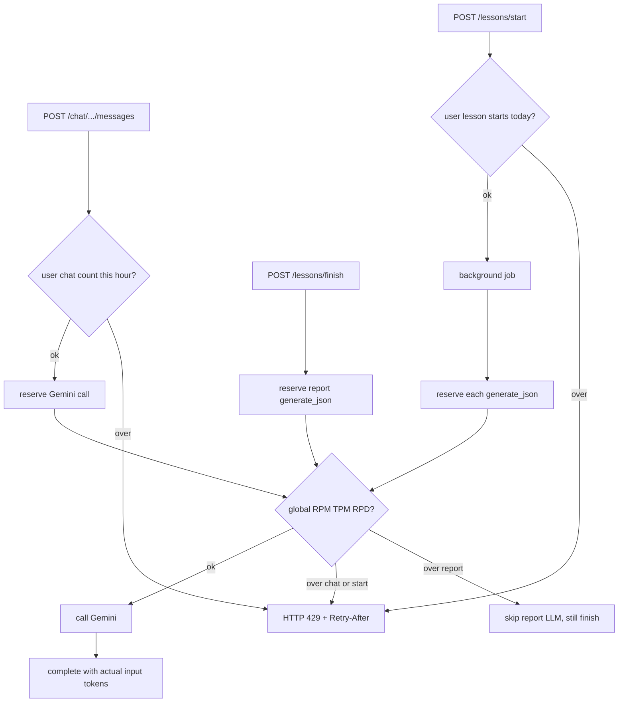

# LLM API usage limits

Persist per-user chat and lesson-start counts, add global pre-flight RPM / input-TPM / RPD caps, and align `config.py` model defaults with the live Flash Lite models.

Check limits **before** each Gemini call on chat (`stream_chat`), lesson generation (`generate_json`), and the finish-time report writer.

## Settings in [app/config.py](../../../apps/backend/app/config.py)

- `gemini_model_chat: str = "gemini-3.5-flash-lite"`
- `gemini_model_lesson: str = "gemini-3.5-flash-lite"`
- `chat_rate_limit_per_hour: int = 60` — per-user chat messages, rolling hour
- `lesson_start_rate_limit_per_day: int = 2` — per-user lesson starts, rolling 24h
- `llm_rpm_limit: int = 15` — Gemini calls, all users, rolling minute
- `llm_input_tpm_limit: int = 250_000` — input tokens, all users, rolling minute
- `llm_rpd_limit: int = 500` — Gemini calls, all users, rolling 24h

`stream_chat` reads `gemini_model_chat`; `generate_json` reads `gemini_model_lesson`. Windows stay 60s / 3600s / 86400s in the limiter.

Also record `429 LLM_RATE_LIMIT_EXCEEDED` and the lesson-start default of `2` in [implementation-readiness.md](../init/implementation-readiness.md).

## Persist and enforce

Add [apps/backend/app/models/llm_usage.py](../../../apps/backend/app/models/llm_usage.py), register it in [app/models/__init__.py](../../../apps/backend/app/models/__init__.py), and add an Alembic migration.

`llm_usage_events`: UUID PK; `user_id` FK `users.id` CASCADE; `TimestampMixin`; `call_type` (`chat` | `lesson_json` | `report`); `model` nullable; `input_tokens` (estimate at reserve, actual `prompt_token_count` on complete); `status` (`reserved` | `ok` | `error`). Indexes: `(created_at)`; `(user_id, created_at, call_type)`.

[app/services/llm_usage.py](../../../apps/backend/app/services/llm_usage.py):

- `check_and_record_user_limit` — per-user chat hour or lesson-start day
- `reserve_gemini_call(db, user_id, call_type, *, estimated_input_tokens)` — global RPM, RPD, and input TPM (existing events plus `chars/4` for this prompt); insert `reserved`
- `complete(db, event, *, input_tokens, status, model)` — write actual input tokens on `ok`

Per-user miss → `429 RATE_LIMIT_EXCEEDED`. Global miss → `429 LLM_RATE_LIMIT_EXCEEDED`. Both set `Retry-After` (60s for RPM/TPM; remaining time in the 24h window for RPD). Reserved and failed calls count toward RPM/RPD. Onboarding and lesson chat share the per-user chat bucket. Each Gemini invocation is one RPM/RPD request, including a lesson repair retry.

## Call paths

**Chat** — [post_chat_message](../../../apps/backend/app/api/v1/chat.py): user hourly check, then after history is loaded `reserve_gemini_call` and `stream_chat`. Pre-flight 429 is HTTP. `on_usage` on `stream_chat` calls `complete` with `prompt_token_count`.

**Lesson start** — [start_lesson](../../../apps/backend/app/api/v1/lessons.py): user daily start check (one count per HTTP start). [run_lesson_generation_job](../../../apps/backend/app/services/lesson_generation.py): `reserve_gemini_call` before each `generate_json`. Repair retry is a second global request and the same per-user start. Job reserve failure fails the job/lesson as today.

**Finish / report** — [update_reports_after_lesson](../../../apps/backend/app/services/report_writer.py): `reserve_gemini_call` for `report`. On a global miss, log and return; `finish_lesson` still commits. On success, `complete` after `generate_json`.

## Errors

In [app/services/gemini.py](../../../apps/backend/app/services/gemini.py), classify `RESOURCE_EXHAUSTED` as `LLM_QUOTA_EXCEEDED` / `quota` before the context-limit markers.

In [app/core/errors.py](../../../apps/backend/app/core/errors.py), let `APIError` accept optional response `headers` and copy them onto the `JSONResponse`.

## Tests

Point existing chat/lesson limit tests ([test_chat_flow.py](../../../apps/backend/tests/test_chat_flow.py), [test_lesson_start_and_sequencing.py](../../../apps/backend/tests/test_lesson_start_and_sequencing.py)) at the DB limiter. Per-test `drop_all`/`create_all` isolates state; keep monkeypatching limits to `1`.

Add:

- global RPM → `429 LLM_RATE_LIMIT_EXCEEDED` + `Retry-After` while the user is under their personal cap
- global input TPM blocks the next call
- global RPD → same 429
- lesson finish succeeds and skips Gemini when report reserve fails
- repair retry increments global RPM/RPD and not the per-user daily start count
- `RESOURCE_EXHAUSTED` maps to `LLM_QUOTA_EXCEEDED`
